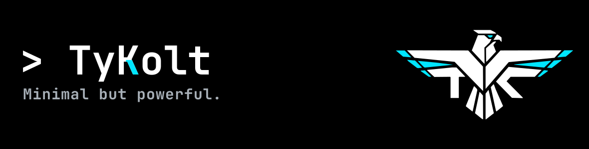
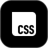
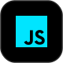

  

  <strong>Open Source Builder | Full-stack in Progress</strong>

  Currently strengthening my <strong>HTML &amp; CSS</strong> skills through practice and projects, leveraging AI to accelerate learning. 🔥💻🚀

  

---

## 🌟 Featured Project

### [Kremis](https://github.com/TyKolt/kremis)

> A deterministic graph-based memory system for AI agents. I direct the development using AI as a coding companion — exploring Rust through hands-on project building.

 **Alpha** &nbsp;|&nbsp; **Built with:** Rust, redb &nbsp;|&nbsp; **License:** Apache 2.0

[**View Repository →**](https://github.com/TyKolt/kremis)

---

## 👨‍💻 About Me

- 🌱 Currently strengthening my **HTML & CSS** skills through hands-on practice
- 🔧 Building **open source projects** with a focus on elegant, efficient solutions
- 🎯 Goal: become a **full-stack developer** capable of creating elegant solutions
- ⚡ Fun fact: I like experimenting with crazy ideas, even if sometimes the code decides to put on its own show! 😅

---

## 🚀 What I'm Doing Now

-  **[Kremis](https://github.com/TyKolt/kremis)** — Deterministic AI memory system *(Alpha)*
-  **HTML & CSS** — Strengthening frontend fundamentals *(Practicing)*
-  **JavaScript** — Next big step in my journey *(Coming Next)*

---

## 🛠️ Tech Stack & Tools

### 🌐 Frontend

  
  

### ⚙️ Tools & Workflow

  
  

### 📚 Currently Learning

  
   <em>JavaScript — Next step in my journey</em>

---

✨ **Thanks for stopping by!** ✨

Check out **[Kremis](https://github.com/TyKolt/kremis)** and follow my journey! 🚀

---
